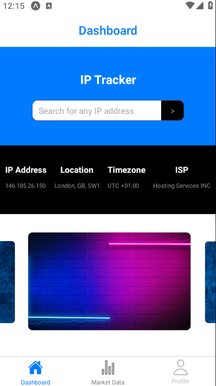
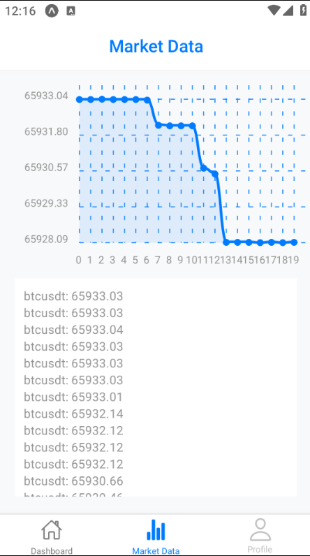
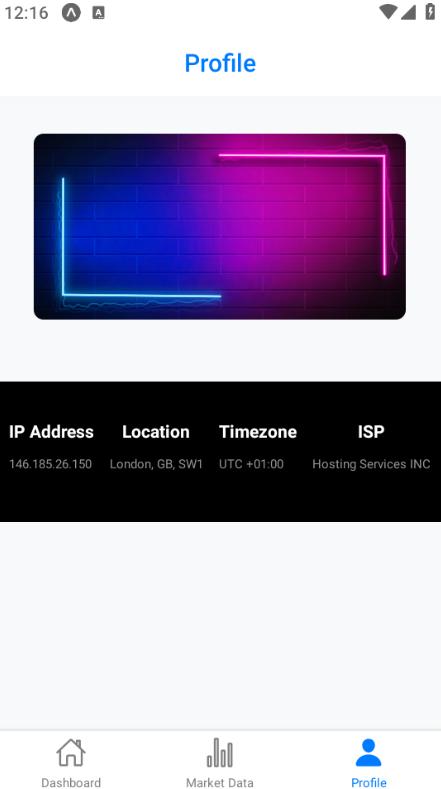

# IP Tracker and Market Data App

This is a React Native application built with Expo. The app allows users to track IP addresses and view related information such as location, timezone, and ISP. Additionally, it provides real-time market data with price charts.

## Features

- **IP Tracker**: Enter an IP address to fetch and display information including IP address, location, timezone, and ISP.
- **Market Data**: View real-time market data with a line chart representing price changes.
- **Profile**: Display profile information based on the selected image and IP data.

## Screenshots





## Installation

1. **Clone the repository**:
   ```bash
   git clone https://github.com/yourusername/ip-tracker-market-data-app.git
   cd ip-tracker-market-data-app
2. **Install Dependencies**:
    ```bash
    npm install
3. **Run the App**:
    ```bash
    npm start

## Build APK

To build the APK, use the following command:

```bash
npm install -g eas-cli
eas login
eas build --platform android
```

## Project Structure
```
├── assets # Image assets
├── components # Reusable components
│ ├── atoms
│ │ ├── Button.tsx
│ │ ├── FormInput.tsx
│ │ ├── ImageSlider.tsx
│ │ └── TextLabel.tsx
│ └── InfoContainer.tsx
├── constants
│ └── api.ts # API constants
│ └── images.ts # Image constants
├── context
│ └── SelectedImageContext.tsx # Context for selected image
├── navigation
│ └── AppNavigator.tsx # Navigation setup
├── types
│ └── components.ts # Components types
│ └── image.ts # Image types
│ └── locationData.ts # Location Data types
│ └── navigation.ts # Navigation types
├── screens # Screen components
│ ├── DashboardScreen.tsx
│ ├── MarketDataScreen.tsx
│ └── ProfileScreen.tsx
├── utils
│ └── helpers.ts # util functions
├── services
│ ├── apiClient.ts # Axios API client
│ ├── api.ts# Function to fetch location data
│ └── connectWebSocket.ts # WebSocket connection
├── styles
│ └── theme.ts # Theme and styles
└── App.tsx # Entry point

```
## Key Dependencies

- **Expo**: Managed workflow for React Native. [Expo Documentation](https://docs.expo.dev/)
- **React Navigation**: Navigation library for React Native. [React Navigation Documentation](https://reactnavigation.org/docs/getting-started)
- **Axios**: Promise-based HTTP client for making API requests. [Axios Documentation](https://axios-http.com/docs/intro)
- **React Native Chart Kit**: Library for displaying charts in React Native. [React Native Chart Kit Documentation](https://github.com/indiespirit/react-native-chart-kit)
- **WebSocket**: For real-time market data communication.

## Utility Functions

### formatPrice

```ts
export const formatPrice = (price: number): string => {
  return `$${price.toFixed(2)}`;
};
```

## Testing

This project uses Jest for testing. To run the tests, use the following command:

```bash
npm test
